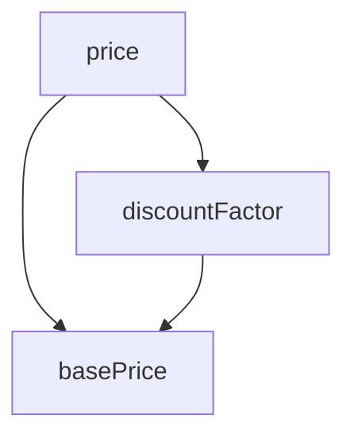

- [7.1 레코드 캡슐화하기](#71-레코드-캡슐화하기)
- [7.2 컬렉션 캡슐화하기](#72-컬렉션-캡슐화하기)
- [7.3 기본형을 객체로 바꾸기](#73-기본형을-객체로-바꾸기)
- [7.4 임시 변수를 질의 함수로 바꾸기](#74-임시-변수를-질의-함수로-바꾸기)
- [7.5 클래스 추출하기](#75-클래스-추출하기)
- [7.6 클래스 인라인하기](#76-클래스-인라인하기)
- [7.7 위임 숨기기](#77-위임-숨기기)
- [7.8 중개자 제거하기](#78-중개자-제거하기)
- [7.9 알고리즘 교체하기](#79-알고리즘-교체하기)


# CHAPTER 07 캡슐화

토비님께서 `데이터와 행위를 묶는게 캡슐화다` 라는 말은 잘못된 생각이라고 하심
무엇이 잘못된 내용인지, 캡슐화에서 중요한 부분이 어떤 것인지 주의깊게 봄

> [!NOTE]
> 모듈을 분리하는 가장 중요한 기준은 비밀을 얼마나 잘 숨기느냐에 있다.
>
> 대표적인 데이터 구조는 `레코드 캡슐화하기` 와 `컬렉션 캡슐화하기` 가 있다.
>
> 기본형 데이터도 `기본형을 객체로 바꾸기` 로 캡슐화할 수 있다.

> [!IMPORTANT]
> 클래스는 본래 정보를 숨기는 용도로 설계되었다.
>
> `위임 숨기기` 클래스는 내부 정보뿐 아니라 클래스 사이의 연결 관계도 숨긴다
> 반대는 `중개자 제거하기`
>
> 캡슐화 단위는 클래스와 모듈, 그리고 함수도 구현을 캡슐화 한다.

_캡슐화는 정보를 숨기고, 숨김으로서 행동을 통제할 수 있게 됨, 그러다 보면 정보와 행동이 묶이게 되는 것으로 생각됨_

## 7.1 레코드 캡슐화하기

```diff 
// javascript
organization = {name: "애크미 구스베리", country: "GB"};
+ class Organization {
+   constructor(data) {
+     this._name = data.name;
+     this._country = data.country;
+   }
+   get name() { return this._name; }
+   set name(aString) { this._name = aString; }
+   get country() { return this._country; }
+   set country(arg) { this._country = arg; }
```

> 대부분의 프로그래밍 언어에서 레코드를 제공하지만, 가변데이터를 저장하는 용도로는 레코드보다 객체를 선호한다.
>
> 사용자는 저장된 값과 계산된 값을 구분할 필요 없다.
>
> 레코드를 캡슐화하는 목적은 변수 자체는 물론 그 내용을 조작하는 방식도 통제하기 위해서다.

_캡슐화는 데이터와 행위의 통제가 목적이고 그 결과로 데이터와 행위가 묶이는것 이라는 생각이 든다.
결과를 목적으로 잘못된 이해로 발생하는 문제는 어떤것이 있을까?_

_목적과 결과를 구분하지 못할 경우 잘못된 기준으로 행위를 정의할 수 있을 것으로 보임.
정보 은닉과 통제 라는 기준을 가질 때 좀 더 객체지향적인 설계가 만들어 지지 않을까 생각됨._

_참고로 Java 14 부터 지원하는 Record 는 객체도 추가할 수 있고 다양한 편의성을 제공하기는 하지만, Lombok 을 사용한 class 와 getter 의 방식이 달라서 Client Code 의 일관성이
떨어져서 효용성이 떨어지는듯 함_

> [!NOTE]
> 해시맵을 사용하는 곳이 많을수록 불분명함으로 인해 발생하는 문제가 커진다.

_해시맵을 무불별하게 사용해서 어려운 코드를 만든 기억이 있다. 각 해시맵을 감싸는 클래스를 만들거나, 해시맵의 키를 String 이 아닌 객체를 사용하는 방법으로 해결하곤 했었다._

> [!NOTE]
> 캡슐화에서는 값을 수정하는 부분을 명확하게 드러내고 한 곳에 모아두는 일이 굉장히 중요하다.

_DTO 를 application layer 에 두고, Entity 를 domain layer 에 둠으로서 Entity 가 DTO 에 의존성을 갖지 않게 하고 싶다 보니 Entity 에 setter 를 두고 DTO
에서 Entity 를 생성하거나 업데이트 하는 방식을 사용하고 있다가, 비록 의존성 방향을 Entity -> DTO 로 바꾸더라도 Dto 를 entity 의 parameter 로 받아서 값을 설정하도록 변경하면
Entity 에서 Setter 를 제거할 수 있었고, 코드상 더 깔끔해지는 경험을 하게 됨._

_지난번에 토비님께서 Domain Service 에 Repository 를 주입하는 부분에 대해 설명하실때 자체적으로 구분한 Layer 가 Spring Data Jpa Repository 를 Application
Layer 에 선언하기로 정해서 사용하던 상황이라서 꺼려지는 느낌이 있었는데, 이도 마찬가지로 Layer 구분 보다는 Service 를 가볍게 하고 로직 부분을 추출하는 편이 더 좋은 코드가 된다고 기준을 다시
잡음_

> [!IMPORTANT]
> 가변데이터는 수정하는 함수를 제한하고, 조회하는 함수에서 복사본을 반환하다고 해도 모호성은 남아있게 된다. 클라이언트에서 조회한 데이터를 수정하면 원본 데이터도 `수정`한다고 착각할 수 있기 때문이다.
> 이럴 때는 `불변 객체` 를 사용하면 된다.

## 7.2 컬렉션 캡슐화하기

```diff javascript
class Person {
-  get courses() { return this._courses; }
+  get courses() { return this._courses.slice(); }
-  set courses(aList) { this._courses = aList; }
+  addCourse(aCourse) { ... }
+  removeCourse(aCourse) { ... }
}
```

> 가변 데이터를 모두 캡슐화하는 편이다. 그러면 데이터 구조가 언제 어떻게 수정되는지 파악하기 쉬워서 구조를 변경하기도 쉬워지기 때문이다.
>
> 컬렉션 자체를 반환하지 않는 방법도 있지만, 클라이언트에서 컬렉션 파이프라인과 같은 패턴을 사용할 수 있도록 컬렉션을 읽기전용으로 제공하는 방법도 낫다.
>
> 복사본을 반환하는 방법도 있고, 이미 여러 코드베이스에서 널리 사용하는 방식이므로 원본과 다름에 문제되지 않는다 (_이전에 제기한 모호성 문제와 상반된다_)

> [!IMPORTANT]
> 중요한 점은 코드베이스에서 일관성을 주는 것이다. 한가지만 적용해서 컬렉션 접근 함수의 동작 방식을 통일해야 한다. (물론 불변컬렉션 원본을 반환하는 방식을 추천하진 않음)
>
> 컬렉션 관리를 책임지는 클래스라면 항상 복제본을 제공해야 한다. (_혹은 불변_)

_복사본을 반환하거나 원본 혹은 불변을 반환하는 방식을 통일해야 한다는 것으로 이해함. 한가지 의아한 점은 코드베이스에서 사용하는 데이터 중 몇가지에 대해 복사본을 만들기 부담스러운 경우라면 이로 인해 모든 케이스를
불변이나 읽기 전용으로 해야 한다는 의미인가?_

## 7.3 기본형을 객체로 바꾸기

```diff 
// javascript
 orders.filter(o => "high" === o.priority || "rush" === o.priority);
+ orders.filter(o => o.priority.higherThan(new Priority("normal")));
```

> [!TIP]
> 단순한 출력 이상의 긱능이 필요해지는 순간 그 데이터를 표현한는 전용 클래스를 정의하는 편이다.

_여기서 `Priority` 는 클래스를 사용하였으나, Java 나 Scala 와 같은 객체지향 정적타입 언어에서는 대신 `enum` 을 사용하는게 좋은듯 하다._

## 7.4 임시 변수를 질의 함수로 바꾸기

```diff
// javascript
const basePrice = this._quantity * this._itemPrice;
- if (basePrice > 1000) return basePrice * 0.95;
- else return basePrice * 0.98;
+ get basePrice() { return this._quantity * this._itemPrice; }
+ ...
+ if (this.basePrice > 1000) return this.basePrice * 0.95;
+ else return this.basePrice * 0.98;
```

> 어떤 코드의 결과값을 다시 사용할 때 임시변수를 사용하곤 하는데 이를 함수로 추출하는 기법이다.
>
> 이는 클래스 안에서 적용시 효과가 가장 좋다. 계산되는 변수가 있을 때 마다 함수로 바꿀수 있는지 살펴보자.
>
> 변수는 값을 한번만 계산하고 그 이후로는 읽기만 해야 한다.

```javascript
get
price()
{
    return this.basePrice * this.discountFactor;
}
get
discountFactor()
{
    var discountFactor = 0.98;
    if (this.basePrice > 1000) discountFactor = 0.95;
    return discountFactor;
}
```

_이 예시에서 추상화 Level 균형이 깔끔하게 맞지는 않는게 조금 거슬리기는 하다. 이런 불균형이 하나 둘 쌓이게 될 경우도 코드의 냄새가 아닐까 생각한다_



## 7.5 클래스 추출하기

```diff
// javascript
class Person {
-  get officeAreaCode() { return this._officeAreaCode; }
-  get officeNumber() { return this._officeNumber; }
+  get officeAreaCode() { return this._telephoneNumber.areaCode; }
+  get officeNumber() { return this._telephoneNumber.number; }
}
+ class TelephoneNumber {
+   get areaCode() { return this._areaCode; }
+   get number() { return this._number; }
+ }
```

> 클래스는 반드시 명확하게 추상화하고 소수의 주어진 역할만 처리해야 한다.
>
> 하지만, 실무에서 몇 가지 연산을 추가하고 데이터도 보강하면서 클래스가 점점 비대해지곤 한다.

> * 일부 데이터와 메서드를 따로 묶을 수 있다면 분리하라는 신호다.
> * 함께 변경되는 일이 많거나 서로 의존하는 데이터들도 분리한다.
> * 제거해도 다른 필드나 메서드 들이 논리적으로 문제가 없다면 분리할 수 있다는 뜻이다.

## 7.6 클래스 인라인하기

```diff
// javascript
class Person {
-  get officeAreaCode() { return this._telephoneNumber.areaCode; }
-  get officeNumber() { return this._telephoneNumber.number; }
+  get officeAreaCode() { return this._officeAreaCode; }
+  get officeNumber() { return this._officeNumber; }
}
- class TelephoneNumber {
-   get areaCode() { return this._areaCode; }
-   get number() { return this._number; }
- }
```

> 더 이상 제 역할을 못 해서 그대로 두면 안 되는 클래스는 인라인해버린다.
>
> 두 클래스의 기능을 지금과 다르게 배분하고 싶을 때도 인라인 후 새로운 클래스를 추출하는 방법을 사용한다.

## 7.7 위임 숨기기

```diff
// javascript
- manager = aPerson.department.manager;
+ manager = aPerson.manager;
+ class Person {
+   get manager() { return this.department.manager; }
+ }
```

> [!IMPORTANT]
> 모듈화 설계를 제대로 하는 핵심은 캡슐화다. 캡슐화는 모듈들이 시스템의 다른 부분에 대해 알아야 할 내용을 줄여준다.
>
> 캡슐화란 필드를 숨기는것 이상 많은 역할이 있다.

_여기서 캡슐화에 대해 다시 생각해 보면 데이터를 외부로 부터 보호하여 무결성을 유지하고, 내부 구현 및 정보를 숨김으로서 외부에 변경에 대한 영향을 최소화 하면서 유지보수성을 높이는 것이라 생각된다._

> [Wikipedia](https://ko.wikipedia.org/wiki/%EC%BA%A1%EC%8A%90%ED%99%94)
>
> 1. 객체의 속성(data fields)과 행위(메서드, methods)를 하나로 묶고,
> 2. 실제 구현 내용 일부를 내부에 감추어 은닉한다.
>
> [Wikipedia](https://en.wikipedia.org/wiki/Encapsulation_(computer_programming))
> 직접 엑세스를 제한하고 메서드와 데이터를 묶는 것을 용이하게 하는 언어 구조다.

## 7.8 중개자 제거하기

```diff
// javascript
- manager = aPerson.manager;
+ manager = aPerson.department.manager;
- class Person {
-   get manager() { return this.department.manager; }
```

> 위임 숨기기와 반대로, 중개자 객체가 너무 많아지면 중개자를 제거하는 방법을 사용한다.

> 이 냄새는 데메테르 법칙<sup>Law of Demeter(디미터 법칙)</sup> 을 너무 신봉할 때 자주 나타난다.
> 이 법칙을 '이따금 유용한 데메테르의 제안' 정도로 보는게 낫다고 생각한다

> 시스템이 바뀌면 '적절하다'의 기준도 바뀌기 마련이다. 6개월 전에는 바람직했던 캡슐화가 이제는 어색할 수 있다. 리펙터링은 결코 미안하다고 말하지 않는다. 즉시 고칠 뿐이다.

_[그 때는 맞고 지금은 틀리다](https://youtu.be/edWbHp_k_9Y?si=a0TX0ZEg7U-ZZMWo&t=349) 라는 말이 생각나는 대목이다_

## 7.9 알고리즘 교체하기

```diff
def foundPerson(people: List[String]): String = {
-  for (person <- people) {
-    if (person == "Don") return "Don"
-    if (person == "John") return "John"
-    if (person == "Kent") return "Kent"
-  }
-  ""
+  people.find(Set("Don", "John", "Kent").contains).getOrElse("")
}

```

> 이 작업은 반드시 메서드를 가능한 한 잘게 나눴는지 확인해야 한다.